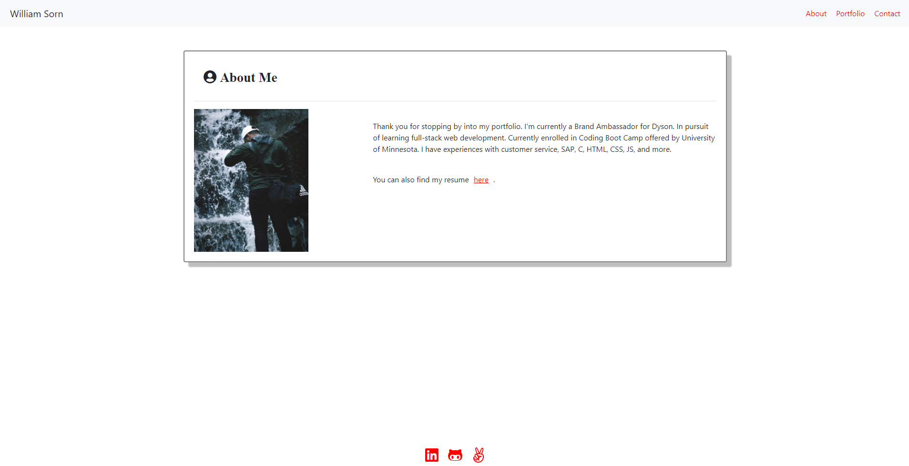

  
# react-portfolio

## Table of Contents 
1. [Description](#description)

2. [Screenshots](#screenshots)

3. [Installation](#installation)

4. [Usage](#usage)

5. [Contributors](#contributors)

6. [Testing](#testing)

7. [Questions](#questions)

    
## Description 
A portfolio using React as a base.

### URL(s)
[Repository](https://github.com/sornwill/react-portfolio)
|
[Heroku Deployed Link](https://ws-react-portfolio.herokuapp.com/)
      
## Screenshots

    
## Installation
npx create-react app 'name', npm react-bootstrap , npm react-router-dom
    
## Usage
General Use 
    
## License
MIT 
    
## Contributors
William Sorn 
    
## Testing
n/a 
      
## Questions
Questions? Please send contact me @sornwill or E-mail : sornwilliam@gmail.com
      
